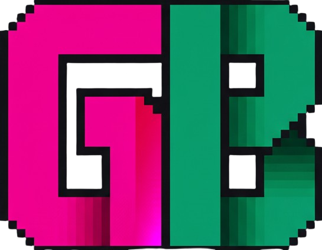

  # grimburly.xyz

Welcome to the repository for grimburly.xyz, a retro-futuristic, interactive terminal website. This project is a fun, single-page portfolio built with vanilla HTML, CSS, and JavaScript, designed to feel like an old-school computer OS.

## About The Project

This site serves as the online home for my "social media" persona, grimburly. It's a playful space designed to contrast with my more formal professional portfolio. Instead of a traditional layout, visitors are greeted with a boot-up sequence and an interactive command line.

### Features

  * **Interactive Terminal:** A fully client-side terminal built from scratch.
  * **Retro Aesthetic:** Styled with a classic green-on-black theme, pixel fonts, and a subtle CRT scan line effect.
  * **ASCII Art:** Features a custom "GRIMBURLY" ASCII art banner on boot.
  * **Dynamic Commands:** Includes a library of commands to learn about me, find my social links, and see my projects.

## Getting Started

Simply open the `index.html` file in any modern web browser to start the GRIMBURLY OS experience.

### Available Commands

  * `help`: Displays a list of all available commands.
  * `whois`: Shows a brief bio.
  * `social`: Lists links to my social media profiles.
  * `projects`: Displays a short list of my recent work.
  * `motd`: Shows the "Message of the Day."
  * `date`: Prints the current date and time.
  * `clear`: Clears the terminal screen.
  * `reboot`: Restarts the boot-up sequence.

## Contributing

Contributions are welcome! If you have a suggestion or find a bug, please open an issue to discuss it.

If you'd like to contribute directly, you can also open a pull request.

## License

Distributed under the MIT License. See `LICENSE` for more information.
